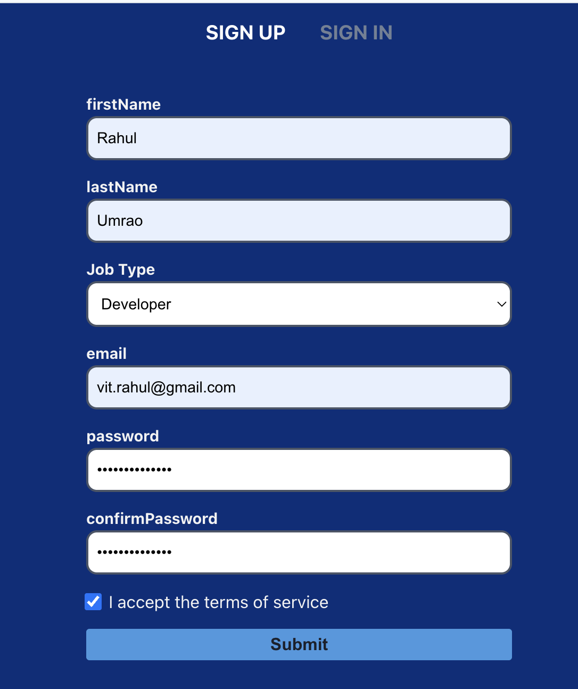
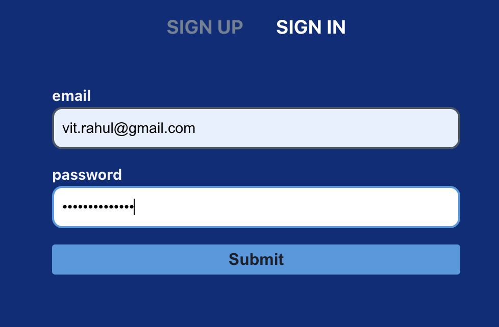
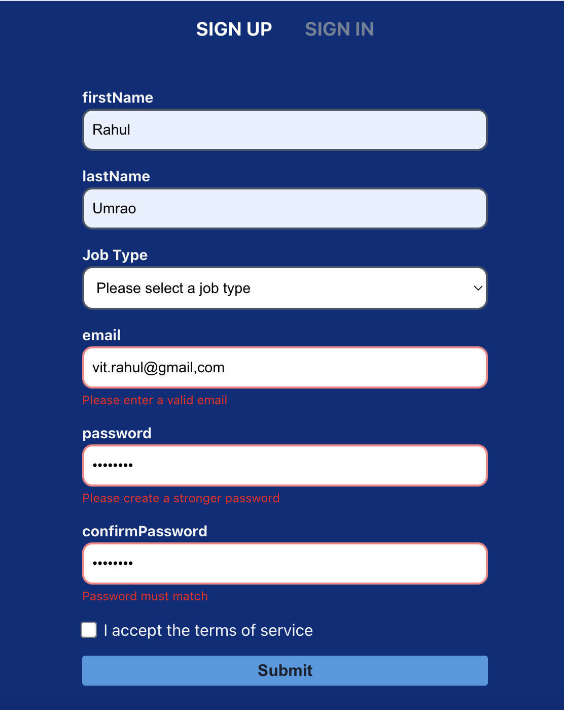

# React Formik Example

This project demonstrates building and validating forms in React using Formik and Yup. It includes both Sign Up and Sign In forms with real-time validation and error display.

---

## How to Run This Project

1. **Install dependencies:**
   ```sh
   npm install
   ```
2. Start the development server:
   ```sh
   npm run dev
   ```
3. Open your browser and visit:  
   http://localhost:5173

### Technologies Used

React – UI library
Formik – Form state management
Yup – Form validation
Vite – Development/build tool
ESLint – Code linting

### Form UI Overview

Sign Up -


Sign In -


### Error Handling & Display

Validation is managed with Yup schemas.
Errors are shown below each field after user interaction if the input is invalid.

